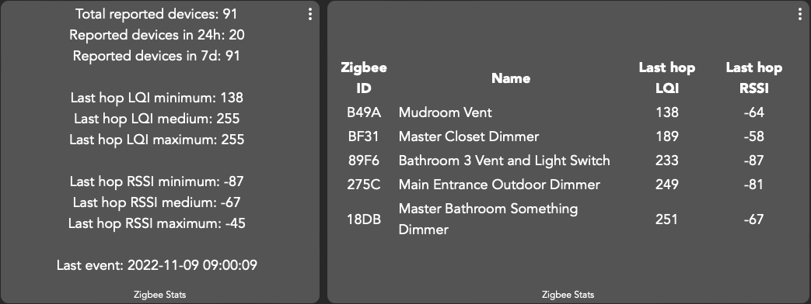

# HubitatZigbeeStats

Hubitat driver and a python script for collecting statistics from Zigbee devices jointed to a hub.
Helps with understanding what is happening with Zigbee network, how good/bad connectivity is.

Python script connects to [Zigbee logs on the hub](https://docs2.hubitat.com/en/user-interface/settings/zigbee-logs). It listens for events, and stores them.
Hubitat driver read statistics generated by the python script.  Since there is a limit on attribute size in hubitat (1024 characters), `/topN` version for tile has a limit on how many devices to return. 

Initial version was implemented as Hubitat driver, however it was never released because the driver would hang the hub.
Assuming it happened because the driver was listening for websocket events generated by the same process, but this is not confirmed.

## Installation
### Python web service
Required: python 3.9+
1. Create a virtual environment, e.g. by running `python3 -m venv venv`
2. Activate the virtual environment, e.g. by running `. venv/bin/activate.sh`
3. Install the requirements, e.g. by running `python3 -m pip install -r requirements.txt`
4. Copy `config-template.toml` to `config.toml` and update the settings
5. Run as a script with `python3 ./listener.py`. 
6. Verify that it works by navigating to `http://<ip-address>:<port-from-settings>`

### Hubitat driver
1. Go to `Driver code`
2. Create `New driver`
3. Past code from `ZigbeeStats.groovy`
4. Go to `Devices`
5. Add a new virtual device with `Type` set to `User/ZigBeeStats`
6. Configure `URL of site running on listener.py` parameter. Take the value from step 6 of the instruction above
7. Enable the device on a dashboard
8. Add attributes `tileStats` and `tileTopN` as tiles on a dashboard

###Example how data looks on a dashboard

